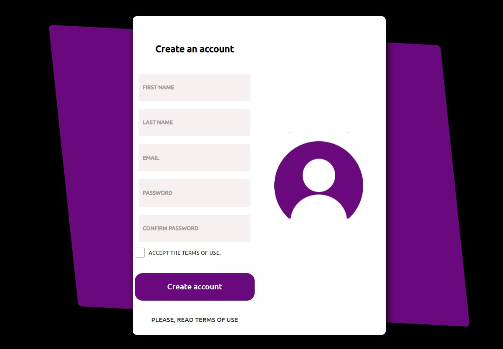

<h1> Responsive Form </h1>

This is a simple and responsive login form made with HTML and CSS.
This project was made from a YouTube tutorial, I changed the colors and created my own user icon in Figma.

YouTube link: https://www.youtube.com/watch?v=Ph-60-pkAQM

Final Result
Web Version

<h2> 🚀 Starting </h2>
To start the project, just open the file index.html in your preferred browser.

Coded with love by Heloise Lui ♥️